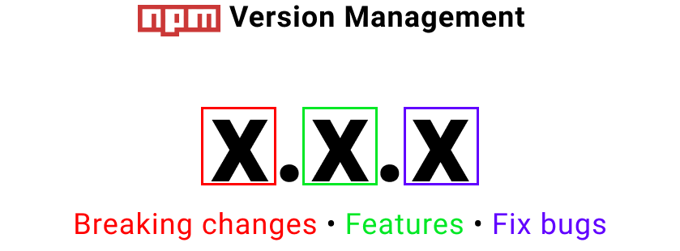

# Mis notas sobre Nodejs

Curso: [Aprendiendo React](https://youtube.com/playlist?list=PLUofhDIg_38qm2oPOV-IRTTEKyrVBBaU7&si=wPEb5EE66u7YVifk)  
Autor del curso: [Miguel Angel Durán](https://github.com/midudev)

## Acerca de

### ¿Qué es Node.js?

[Nodejs](https://nodejs.org/) es como un "superpoder" para JavaScript. Permite ejecutar este lenguaje no solo en navegadores, sino también en el servidor, la terminal e incluso en dispositivos como la Nintendo Switch.

Es gratis, funciona en todas las plataformas (Windows, Mac, Linux, etc.), y su forma de trabajar (asíncrona) lo hace muy rápido. Todo esto lo hace posible el motor [V8](#v8), el mismo que usa Google Chrome.

### V8

Es el motor de JavaScript desarrollador por Google y utilizado en Chrome, lo que ha permitido que el lenguaje mejore y evolucione, aumentando significativamente la velocidad de ejecución.

### ¿Por qué aprenderlo?

1. Existe una gran demanda en el mercado laboral.
2. Los desarrolladores de JavaScript se familiarizan fácilmente con su sintaxis.
3. Permite crear una amplia variedad de aplicaciones, como web, de escritorio, APIs, scrapers, servicios y utilidades.
4. Cuenta con una gran comunidad de desarrolladores.
5. Node.js cuenta con el ecosistema de paquetes más grande del mundo a través de NPM.
6. Es rápido, escalable, económico y fácil de desplegar.

### Historia

Node.js fue creado en 2009 por [Ryan Dahl](https://en.wikipedia.org/wiki/Ryan_Dahl). Él estaba frustrado con las limitaciones de los servidores web tradicionales (Apache HTTP Server), así que decidió construir uno nuevo que pudiera manejar muchas conexiones al mismo tiempo.

## Formas de instalar

En la página oficial de [Nodejs](https://nodejs.org/en/download) hay dos versiones:

> [!NOTE]
> Aún no descargues ni instales nada hasta leer toda la sección.


|LST (Recomendada)|Current|
|-|-|
|Significa Soporte a largo plazo (*Long Term Support*) es la versión más estable y que siempre están actualizando.|Cuenta con las últimas caracteristicas y funcionalidades nuevas pero que aún se consideran inestables.|

La desventaja de instalarlo de esta forma es que solo implementará una única versión en el ordenador. Con [NVM](https://github.com/nvm-sh/nvm) (*Node.js Version Manager*) es posible administrar distintas versiones de node.

Una mejor alternativa a NVM es [FNM](https://github.com/Schniz/fnm) (*Fast Node.js manager*) - Gestor de versiones de Node.js rápido y sencillo construído en Rust.

## Instalaciones

1. **[Rust](https://www.rust-lang.org/es/tools/install):** Para instalar FNM es requerido tener instalado Rust, desgargue RUSTUP-INIT.EXE dependiendo de la arquitectura de bits del ordenador. Para asegurarte de que ya está instalado:

    ```bash
    rustc --version
    ```

2. **[FNM](https://github.com/Schniz/fnm):** Para instalarlo en Windows desde la terminal:

    ```bash
    winget install Schniz.fnm
    ```

    Reinicie la terminal y asegurese de tener instalado FNM:

    ```bash
    fnm --version
    ```

3. **[NodeJS](https://nodejs.org/en/download):** Primero selecciona la versión de Node que deseas instalar y usa FNM:

    ```bash
    # Instalar la versión LTS actual
    fnm install --lts

    # O puede especificar una versión
    fnm install 20.13.1
    ```

    Asegurese de haber instalado node en su versión correspondiente:

    ```bash
    fnm list
    ```

    En caso de tener varias versiones y desea usar una versión instalada:

    ```bash
    fnm use 20.13.1
    ```

    Finalmente, para asegurarse de la versión definida:

    ```bash
    node --version
    ```

Mientras hacia todo el proceso, tuve problemas al momento de usar una versión, únicamente tuve que ejecutar este comando en power shell:

```bash
fnm env --use-on-cd | Out-String | Invoke-Expression
```

## Primero pasos

Con NodeJS puede ejecutar la linea de comando [REPL](https://nodejs.org/en/learn/command-line/how-to-use-the-nodejs-repl) (*Read Evaluate Print Loop*) para iniciar el entorno de desarrollo en la terminal:

```bash
node
```

Esto permitirá que pueda ejecutar código de node similar a la consola del navegador, por ejemplo un **Hola mundo**

```bash
const a = 'Hola mundo'
```

```bash
console.log(a)
```

Puedes ejecutar instrucciones matemáticas:

```bash
2 + 2
```

En lugar de usar REPL, puedes ejecutar un archivo js. En la carpeta `./exercices/00.first-time/` se encuentra un index.js que contiene lo siguiente:

### Impresiones

```js
//🔹 El console log, info y error se muestran igual en la consola
console.log('Hello world1!')
console.info('Hello world2!')
console.error('Hello world3!')
```

### Objetos globales

```js
console.log(window) // ❌ En Node, no existe el objeto global `window`
console.log(typeof window) // undefined

//🔹 Objeto global para node
console.log(global)

//🔹 Objeto global que apunta a `global` y `window` (recomendado)
console.log(globalThis)

window.console.log('Desde window') // ⚠️ En Node no funcionaría pero en el navegador sí
global.console.log('Desde global') // ⚠️ En Node funciona pero en el navegador no
globalThis.console.log('Desde globalThis') // ✔️ Funcionaría para casos (⭐ Recomendado)
```

## Patrón de diseño módulo

### CommonJS

- **Exportar una función para usarla en otros archivos**

    ```js
    // Ejemplo 1
    function sum(a, b) { return a + b }

    //🔹 Exporta la función por defecto y pueden renombrarlo
    module.exports = sum
    ```

    ```js
    // Ejemplo 2
    function sum(a, b) { return a + b }

    //🔹 Para obligar a que usen el nombre de la función
    module.exports = { sum }
    ```

- **Importar la función desde otro archivo**

    ```js
    // Ejemplo 1
    const mySum = require('./path/sumFile')
    console.log(mySum(2,3)) // 5
    ```

    ```js
    // Ejemplo 2
    const { sum } = require('./path/sumFile')
    console.log(sum(7,3)) // 10
    ```

### ES Modules (⭐)

- **Exportar una función para usarla en otros archivos**

    ```js
    // Ejemplo 1
    function sum(a, b) { return a + b }

    //🔹 Exporta la función por defecto y pueden renombrarlo
    export default sum
    ```

    ```js
    // Ejemplo 2
    function sum(a, b) { return a + b }

    //🔹 Para obligar a que usen el nombre de la función
    export { sum }
    ```

- **Importar la función desde otro archivo**

    ```js
    // Ejemplo 1
    import mySum from './path/file'
    console.log(mySum(2,3)) // 5
    ```

    ```js
    // Ejemplo 2
    import { sum } from './path/file'
    console.log(sum(7,3)) // 10
    ```

Para ejecutar el archivo, abre la terminal en la ubicación del script y ejecuta:

```bash
node index.js
```

### Extensiones

Node permite ejecutar script de JavaScript en diferentes extensiones:

|.js|.cjs|.mjs|
|-|-|-|
|Por defecto usa el patrón de diseño CommonJS|Forza a usar el patrón de diseño CommonJS|Forza a usar el patrón de diseño ES Modules|

## Módulos nativos de NodeJS

Al momento de importar un módulo de Node es posible hacerlo de la siguiente forma:

```js
const os = require('os') // ⚠️
const os = require('node:os') // ✅
```

>[!WARNING]
Pero a partir de la versión 16 de Node, ya no es recomendable importar los módulos directamente del módulo nativo. Lo recomendable es usar el prefijo de node.

### Operating System

```js
const os = require('node:os') // (⭐)

console.log('Información del sistema operativo');
console.log('---');

console.log('Sistema Operativos:',os.platform());
console.log('Versión:',os.release());
console.log('Arquitectura:',os.arch());
console.log('CPUs:',os.cpus());
console.log('Memoria libre:',os.freemem() / 1024 / 1024,'MB');
console.log('Memoria total:',os.totalmem() / 1024 / 1024,'MB');
console.log('Tiempo encendido:',os.uptime()/60/60,'horas');
```

Este mismo ejemplo en ES Module quedaría de la siguiente manera:

```js
import { platform, release, arch, cpus, freemem, totalmem, uptime } from 'node:os';

console.log('Información del sistema operativo');
console.log('---');

console.log('Sistema Operativos:',platform());
console.log('Versión:',release());
console.log('Arquitectura:',arch());
console.log('CPUs:',cpus());
console.log('Memoria libre:',freemem() / 1024 / 1024,'MB');
console.log('Memoria total:',totalmem() / 1024 / 1024,'MB');
console.log('Tiempo encendido:',uptime()/60/60,'horas');
```

### File System

1. Ver estadísticas de un archivo:

    ```js
    const fs = require('node:fs')

    const stats = fs.statSync('./archivo.txt')

    console.log(
      // Si es un fichero
      stats.isFile(), // true

      // Si es un directorio
      stats.isDirectory(), // false

      // Si es un enlace simbólico
      stats.isSymbolicLink(), // false

      // Tamaño en byter
      stats.size // 12

    )
    ```

2. Leer el contenido de un archivo (utf-8, sync, callbacks, promises):

    1. UTF-8:

        ```js
        const fs = require('node:fs')

        const text1 = fs.readFileSync('./archivo.txt')
        console.log(text1); // <Buffer 48 65 6c 6c 6f 20 57 6f 72 6c 64 21>

        const text2 = fs.readFileSync('./archivo.txt', 'utf-8')
        console.log(text2); // Hello World!
        ```

    2. Leer archivos de forma Síncrona:

        ```js
        console.log('⌛ Leyendo el Primer Archivo...');
        const text3 = fs.readFileSync('./archivo.txt', 'utf-8')
        console.log('✅ Primer archivo leído (sincrónicamente) =>', text3); // Hello World!

        console.log('⌛ Leyendo el Segundo Archivo...');
        const text4 = fs.readFileSync('./archivo.txt', 'utf-8')
        console.log('✅ Segundo archivo leído (sincrónicamente) =>', text4); // Hello World!

        ```

    3. Leer archivos de forma Asíncrona con Callback:

        ```js
        console.log('⌛ Leyendo el Primer Archivo:');
        fs.readFile('./archivo.txt', 'utf-8', (err, text) => {
          console.log('✅ Primer archivo leído (asincrónicamente) =>', text); // Hello World!
        })

        console.log('♻️ Haciendo cosas mientras lee el archivo...');

        console.log('⌛ Leyendo el Segundo Archivo...');
        fs.readFile('./archivo2.txt', 'utf-8', (err, text) => {
          console.log('✅ Segundo archivo leído (asincrónicamente) =>', text); // Hello World!
        })

        console.log('♻️ Sigo haciendo otras cosas mientras lee el archivo...');
        console.log('🤓 Aquí finalizaría de leer el código.');
        ```

    4. Leer archivos de forma Asíncrona con promesas:

        ```js
        const fs = require('node:fs/promises')

        console.log('⌛ Leyendo el Primer Archivo:');
        fs.readFile('./archivo.txt', 'utf-8')
          .then(text => {
            console.log('✅ Primer archivo leído (asincrónicamente) =>', text); // Hello World!
          })

        console.log('♻️ Haciendo cosas mientras lee el archivo...');

        console.log('⌛ Leyendo el Segundo Archivo...');
        fs.readFile('./archivo2.txt', 'utf-8')
          .then(text => {
            console.log('✅ Segundo archivo leído (asincrónicamente) =>', text); // Hello World!
          })

          
        console.log('♻️ Sigo haciendo otras cosas mientras lee el archivo...');
        console.log('🤓 Aquí finalizaría de leer el código.');
        ```

    5. Leer archivos de forma Asíncrona con Async/Await:

        ```js
        const { readFile } = require('node:fs/promises')

        // IIFE - Inmediatly Invoked Function Expression
        ;(
          async () => {
            console.log('⌛ Leyendo el Primer Archivo:');
            const text1 = await readFile('./archivo.txt', 'utf-8');
            console.log('✅ Primer archivo leído (asincrónicamente) =>', text1); // Hello World!

            console.log('♻️ Haciendo cosas mientras lee el archivo...');

            console.log('⌛ Leyendo el Segundo Archivo...');
            const text2 = await readFile('./archivo2.txt', 'utf-8');
            console.log('✅ Segundo archivo leído (asincrónicamente) =>', text2); // Hello World!
              
            console.log('♻️ Sigo haciendo otras cosas mientras lee el archivo...');
            console.log('🤓 Aquí finalizaría de leer el código.');
          }
        )()
        ```

    6. Leer archivos de forma Asíncrona paralelamente:

        ```js
        const { readFile } = require('node:fs/promises')

        Promise.all([
          readFile('./archivo.txt', 'utf-8'),
          readFile('./archivo2.txt', 'utf-8')
        ]).then(([text1, text2]) => {
          console.log('✅ Primer archivo leído (asincrónicamente) =>', text1);
          console.log('✅ Segundo archivo leído (asincrónicamente) =>', text2);
        })
        ```

### Path

En Nodejs está prohibido unir rutas de forma convencional (`ruta/carpeta/archivo`), esto es debido a que no todos los sistemas operativos usan el mismo caracter para separar cada directorio. Por ejemplo en Windows si ejecutamos el siguiente script de node:

```js
const path = require('node:path')

// Obtener el separador de directorios del SO
console.log(path.sep); // \

```

El separador es `\`, pero por ejemplo en MacOS es `/` y el otros sistemas operativos podría ser completamente diferente.

Para unir directorios, se usa `join`:

```js
const path = require('node:path')

const filePath = path.join('ruta','carpeta','archivo')
console.log(filePath) // ruta\carpeta\archivo
```

Para obtener el nombre de un fichero en una ruta, se usa `basename`:

```js
const readmeFile = path.basename('ruta/carpeta/readme.txt')
console.log(readmeFile) // readme.txt

const readmeFileName = path.basename('ruta/carpeta/readme.txt', '.txt')
console.log(readmeFileName) // readme
```

Para obtener la extensión de un fichero, se `extname`:

```js
const imageExt = path.extname('ruta/carpeta/image.jpg')
console.log(imageExt) // .jpg
```

## NPM

Node Package Manager (NPM) es el administrador de paquetes que Node.js instala por defecto y cuenta con el registro de paquetes más grande del mundo. NPM se compone de dos partes principales:

- **Registro de paquetes NPM:** Es el repositorio donde se alojan todas las dependencias de los proyectos de Node.
- **Linea de comandos NPM** Es la herramienta que se utiliza para instalar, actualizar y gestionar estas dependencias desde la terminal.

### Inicializar proyecto

Para generar o inicializar un proyecto usando la línea de comandos npm, abre una terminal y ejecuta:

```bash
npm init
```

Esta realizará una serie de preguntas que permitirá registrar algunos datos básicos del proyecto. Es posible evitar estos pasos añadiendole la bandera `-y` para que se establezcan valores predeterminados:

```bash
npm init -y
```

Esto generará el fichero `package.json` que se luce de la siguiente manera:

```json
{
  // Acerca del proyecto 
  "name": "project-name",
  "version": "1.0.0",
  "description": "",
  "keywords": [],
  "author": "",
  "license": "ISC",

  // Punto de entrada principal de la app
  "main": "index.js",

  // Scripts personalizados que permiten ejecutar 
  // diferentes operaciones con 'npm run <script>'
  "scripts": {
    "test": "echo \"Error: no test specified\" && exit 1"
  },
}
```

### Instalación de paquetes

Para instalar un nuevo paquete, por ejemplo [picocolors](https://www.npmjs.com/package/picocolors) se realiza de la siguiente manera:

```bash
npm install picocolors
```

Este comando instalará el paquete y lo registrará automáticamente en las dependencias del proyecto dentro del archivo `package.json`. Es importante destacar que los paquetes se dividen en dos grupos distintos:

- **Paquetes de Producción:** Estos son los paquetes necesarios para que tu aplicación funcione correctamente en un entorno de producción.
- **Paquetes de Desarrollo:** Estos son los paquetes necesarios solo durante el desarrollo de tu aplicación, como herramientas de prueba, compiladores o linters.

Al instalar un paquete sin especificar explícitamente su uso, npm lo colocará automáticamente en el grupo de producción. Sin embargo, si deseas instalar un paquete para su uso exclusivo durante el desarrollo, puedes agregar la bandera `--save-dev` al comando `npm install`:

```bash
npm install picocolors --save-dev
```

O también usar `--development` o incluso su respectiva abreviación `-D` *(Importante la D mayuscula)*:

```bash
npm install picocolors -D
```

### Versiones

Además de registrar el nombre de la dependencia en el `package.json`, también se registrará la respectiva versión. Luciría de la siguiente manera:

```json
{
  "name": "xd",
  "version": "1.0.0",
  "main": "index.js",
  "scripts": {
    "test": "echo \"Error: no test specified\" && exit 1"
  },
  "keywords": [],
  "author": "",
  "license": "ISC",
  "description": "",

  // Dependecias de producción
  "dependencies": {
    "picocolors": "^1.0.1",
    
    // otras dependencias de ejemplo
    "ejemplo1": "^16.4.6",
    "ejemplo2": "^21.3.5",
    "ejemplo3": "^5.30.1",
  },

  // Dependecias de desarrollo
  "dependencies": {
    "picocolors": "^1.0.1",
    
    // otras dependencias de ejemplo
    "ejemplo1": "^16.4.6",
    "ejemplo2": "^21.3.5",
    "ejemplo3": "^5.30.1",
  }
}
```

Cuando instalas una dependencia, se añadirá un Caret (^) al número de la versión. Esto indica a NPM que instale cualquier nueva versión que incluya mejoras *(Features)* o correcciones de errores *(Fix bugs)*, pero sin incluir cambios que rompan la compatibilidad.



- **Breaking changes *(Cambios importantes)*:** También conocida como MAJOR *(Mayor)*. Estos cambios rompen la compatibilidad con versiones anteriores. El caret no permite la actualización automática a estas versiones. Ejemplo:
  - Refactorización que cambia las APIs públicas.
  - Eliminación de funcionalidades obsoletas.
  - Cambios en el comportamiento que pueden romper la compatibilidad con versiones anteriores.
- **Features *(Nuevas funcionalidades)*:** También conocida como MINOR *(Menor)*. El caret permite la actualización a versiones que añaden nuevas funcionalidades sin romper la compatibilidad. Ejemplo:
  - Adición de nuevas APIs o funcionalidades.
  - Mejoras en la implementación de las funcionalidades existentes.
  - Nuevas opciones o configuraciones que no afectan el comportamiento actual.
- **Fix bugs *(Corrección de errores)*:** También conocida como PATCH *(Parche)*. El caret también permite la actualización a versiones que incluyen correcciones de errores. Ejemplo:
  - Corrección de errores y fallos.
  - Mejoras de rendimiento sin cambios en la API.
  - Ajustes menores que no afectan la compatibilidad ni añaden nuevas funcionalidades.

> [!WARNING] Advertencia
> Elimina el Caret (^) de las dependencias porque podría romper la aplicación si las nuevas actualizaciones no son compatibles.

Es recomendable que al actualizar una dependencia, se ponga a prueba el funcionamiento de toda la app.

> [!TIP] Pro-tip
> Usa la bandera `-E` al momento de instalar una dependencia para que use siempre la versión exacta, es decir, que no añada el Caret.
>
> ```bash
> npm install picocolors -E
> ```

### Instalación de dependecias

Al tener las dependencias registradas en el `package.json`, se debe ejecutar el siguiente comando para instalarlas:

```bash
npm install
```

Además de instalar las dependencias, es aquí cuando se actualizan las versiones en caso de que tengan el Caret (^)

Una vez instalada todas las dependencias, estas se alojarán en una carpeta llamada `node_modules`. Se instalará la dependencia instalada, y las dependencias que requiere la dependencia instalada, y así recursivamente.

### Desinstalación de dependencias

Si por alguna razón, se requiere borrar una dependencia y además los scripts descargados de una dependencia especifica:

```bash
npm unistall picocolors
```

### Importar dependencia

Depdendiendo del patrón de diseño módulo, se importa de una u otra forma:

```js
// Tipo CommonJS
const picocolors1 = require('picocolors');

// Tipo ES Modules
import picocolors2 from 'picocolors';

// Usar la dependencia
console.log(picocolors2.red('❌ Esto es un mensaje de error de color rojo.'));
```

## Crear un servidor con Node

Para crear un servidor utilizando Node de forma básica, se utiliza el módulo `http` de la siguiente manera:

```js
const http = require('node:http')

const port = process.env.PORT ?? 3000

// Crear servidor http
const server = http.createServer((request, response)=>{
  console.log('Request:',request) // <-- Imprime por la terminal
  response.end('Hello World!') // <-- Imprime en el cliente
})

// Escuchar en el puerto 3000 o en el que establezca
server.listen(port, () => {
  console.log(`Server running on port http://localhost:${server.address().port}`)
})
```

En este ejemplo, el servidor responde con "Hello World!" a todas las solicitudes que recibe.

> [!TIP] Pro-tip
> Si se establece el puerto en 0, Node.js seleccionará automáticamente un puerto disponible al azar, **pero sólo es recomendable en modo desarrollo.**

Para establecer un puerto como variable de entorno del sistema, asignela antes de ejecutar el script de la siguiente manera:

```bash
PORT=1234 node index.js
```

### Obtener un puerto abierto

Primero se crea la función para usar el puerto deseado o buscar un puerto disponible usando el módulo `net`:

```js
const net = require('node:net')

function findAvailablePort (desiredPort) {
  return new Promise((resolve, reject) => {
    const server = net.createServer()

    // Verificar si es posible usar el puerto
    server.listen(desiredPort, () => {
      const { port } = server.address()
      server.close(() => {
        resolve(port)
      })
    })

    // En caso de que ya esté ocupado el puerto
    // o haya un error cualquiera 
    server.on('error', (err) => {
      if (err.code === 'EADDRINUSE') {
        findAvailablePort(0).then(port => resolve(port))
      } else {
        reject(err)
      }
    })
  })
}

module.exports = { findAvailablePort }
```

Ahora se usa esta función al crear el servidor de la siguiente manera:

```js
const http = require('node:http')
const { findAvailablePort } = require('./find-available-port.js')

const port = process.env.PORT ?? 3000

const server = http.createServer((req, res)=>{
  res.end('Hello World!')
})

findAvailablePort(port)
  .then(port => {
    server.listen(port, () => {
      console.log(`Server running on port http://localhost:${port}`)
    })
  })
```
