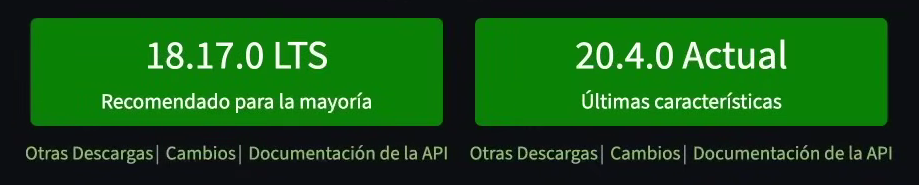

# Mis notas sobre Nodejs

Curso: [Aprendiendo React](https://youtube.com/playlist?list=PLUofhDIg_38qm2oPOV-IRTTEKyrVBBaU7&si=wPEb5EE66u7YVifk)  
Autor del curso: [Miguel Angel Durán](https://github.com/midudev)

## Acerca de

### ¿Qué es Node.js?

[Nodejs](https://nodejs.org/) es como un "superpoder" para JavaScript. Permite ejecutar este lenguaje no solo en navegadores, sino también en el servidor, la terminal e incluso en dispositivos como la Nintendo Switch.

Es gratis, funciona en todas las plataformas (Windows, Mac, Linux, etc.), y su forma de trabajar (asíncrona) lo hace muy rápido. Todo esto lo hace posible el motor [V8](#v8), el mismo que usa Google Chrome.

### V8

Es el motor de JavaScript desarrollador por Google y utilizado en Chrome, lo que ha permitido que el lenguaje mejore y evolucione, aumentando significativamente la velocidad de ejecución.

### ¿Por qué aprenderlo?

1. Existe una gran demanda en el mercado laboral.
2. Los desarrolladores de JavaScript se familiarizan fácilmente con su sintaxis.
3. Permite crear una amplia variedad de aplicaciones, como web, de escritorio, APIs, scrapers, servicios y utilidades.
4. Cuenta con una gran comunidad de desarrolladores.
5. Node.js cuenta con el ecosistema de paquetes más grande del mundo a través de NPM.
6. Es rápido, escalable, económico y fácil de desplegar.

### Historia

Node.js fue creado en 2009 por [Ryan Dahl](https://en.wikipedia.org/wiki/Ryan_Dahl). Él estaba frustrado con las limitaciones de los servidores web tradicionales (Apache HTTP Server), así que decidió construir uno nuevo que pudiera manejar muchas conexiones al mismo tiempo.

## Formas de instalar

En la página oficial de [Nodejs](https://nodejs.org/en/download) hay dos versiones:

> [!NOTE]
> Aún no descargues ni instales nada hasta leer toda la sección.



|LST (Recomendada)|Current|
|-|-|
|Significa Soporte a largo plazo (*Long Term Support*) es la versión más estable y que siempre están actualizando.|Cuenta con las últimas caracteristicas y funcionalidades nuevas pero que aún se consideran inestables.|

La desventaja de instalarlo de esta forma es que solo implementará una única versión en el ordenador. Con [NVM](https://github.com/nvm-sh/nvm) (*Node.js Version Manager*) es posible administrar distintas versiones de node.

Una mejor alternativa a NVM es [FNM](https://github.com/Schniz/fnm) (*Fast Node.js manager*) - Gestor de versiones de Node.js rápido y sencillo construído en Rust.

## Instalaciones

1. **[Rust](https://www.rust-lang.org/es/tools/install):** Para instalar FNM es requerido tener instalado Rust, desgargue RUSTUP-INIT.EXE dependiendo de la arquitectura de bits del ordenador. Para asegurarte de que ya está instalado:

    ```bash
    rustc --version
    ```

2. **[FNM](https://github.com/Schniz/fnm):** Para instalarlo en Windows desde la terminal:

    ```bash
    winget install Schniz.fnm
    ```

    Reinicie la terminal y asegurese de tener instalado FNM:

    ```bash
    fnm --version
    ```

3. **[NodeJS](https://nodejs.org/en/download):** Primero selecciona la versión de Node que deseas instalar y usa FNM:

    ```bash
    # Instalar la versión LTS actual
    fnm install --lts

    # O puede especificar una versión
    fnm install 20.13.1
    ```

    Asegurese de haber instalado node en su versión correspondiente:

    ```bash
    fnm list
    ```

    En caso de tener varias versiones y desea usar una versión instalada:

    ```bash
    fnm use 20.13.1
    ```

    Finalmente, para asegurarse de la versión definida:

    ```bash
    node --version
    ```

Mientras hacia todo el proceso, tuve problemas al momento de usar una versión, únicamente tuve que ejecutar este comando en power shell:

```bash
fnm env --use-on-cd | Out-String | Invoke-Expression
```
